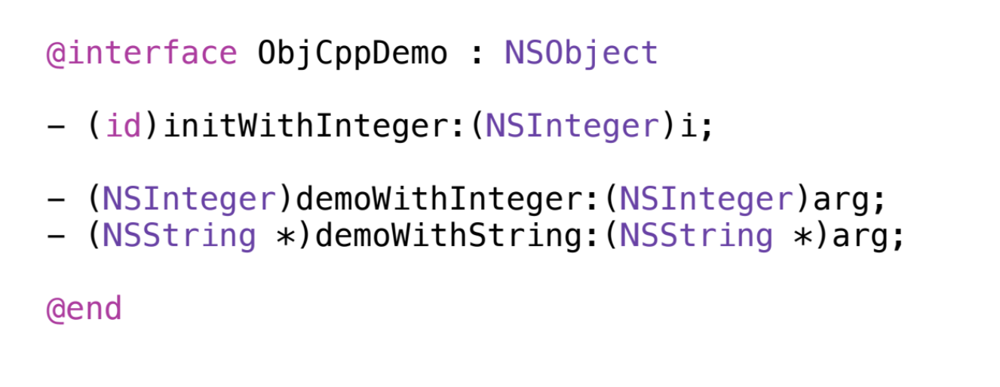

export { default as theme } from "./theme";
import { Image, Appear, Grid, Notes } from "mdx-deck";
import { Invert } from "mdx-deck/layouts";
import { Diagram, Box } from "./Box";

# Cross platform <br/> React Native

## Beyond the Bridge \*

<div
  style={{
    opacity: 0.8,
    fontSize: 30,
    display: "flex",
    flexDirection: "row",
    justifyContent: "stretch",
    alignItems: "baseline"
  }}
>
  <div
    style={{
      width: "50%",
      textAlign: "right",
      marginRight: "2rem"
    }}
  >
    <div>Rudi Yardley</div>
  </div>
  <div
    style={{
      width: "50%",
      textAlign: "left",
      marginTop: "2rem"
    }}
  >
    <div>twitter: @rudiyardley</div>
    <div>github: @ryardley</div>
    <div>medium: @ryardley</div>
  </div>
</div>

---

### Summary

<Appear>
  <div>1. Mobile is Polyglot</div>
  <div>2. Why I went down this path</div>
  <div>3. RNBridge: Demo</div>
  <div>4. Djinni and C++: Demo</div>
  <div>5. Questions</div>
</Appear>

---

About you

# React Native?

<Notes>
  <div>React Native</div>
  <ul>
    <li>Who has never heard of React Native?</li>
    <li>Aware of React Native but not played with it?</li>
    <li>Done a couple of tutorials?</li>
    <li>Use it day to day?</li>
    <li>Expert?</li>
  </ul>
</Notes>

---

About you

# X-PLATFORM MOBILE?

<Notes>
  <div>
    Who here is developing:
    <ul>
      <li>CROSS PLATFORM mobile apps?</li>
      <li>iOS only?</li>
      <li>Android only?</li>
      <li>Windows Phone?</li>
    </ul>
  </div>
</Notes>

---

About you

# MOBILE TECH?

<Notes>
  <div>
    <div>
      I am going to reel off a bunch of tech to get a sense of your experience
    </div>
    <div>Use this tech in your apps:</div>
    <ul>
      <li>ReactNative Bridge?</li>
      <li>Objective-C or Swift?</li>
      <li>Java or Kotlin?</li>
      <li>Kotlin Native?</li>
      <li>Objective-C++?</li>
      <li>C++?</li>
      <li>JNI?</li>
      <li>Djinni? - if so you guys know more about this than I </li>
    </ul>
  </div>
</Notes>

---

#### Disclaimer

# I am not an expert

<Appear>
  <div>I am a React Native newbie</div>
  <div>I went on a deep dive</div>
  <div>Here to share my learnings</div>
</Appear>

---

#### Rudi Yardley : About me

<Appear>
  <div>Freelance Senior Fullstack Engineer</div>
  <div>JavaScript / TypeScript / React / Node</div>
  <div>Seek / Museum Vic / ACMI</div>
  <div>GoodCompany</div>
</Appear>

<Notes>
  <div>- Freelance Senior Fullstack Engineer</div>
  <div>- JavaScript/TypeScript/React/Node</div>
  <div>- Projects: Seek / Museum Vic / ACMI / Telstra</div>
  <div>
    - Currently working with GoodCompany on their marketplace connecting
    businesses and charities
  </div>
</Notes>

---

### Background in Mobile Development

<Appear>
  <div>Commercial Universal Cordova App ~ 2012</div>
  <div>React Native ~ November 2018</div>
  <div>Only dabbled in mobile development</div>
  <div>Total C/C++ newb</div>
</Appear>

<Notes>
  <div>Commercial Universal Cordova App ~ 2012</div>
  <div>React Native ~ November 2018</div>
  <div>Only dabbled in mobile development</div>
  <div>Total C/C++ newb</div>
</Notes>

---

# I 💛 JS

<Notes>
  <ul>
    <li>Fantastic lanugage</li>
    <li>EcmaScript</li>
    <li>TC39</li>
    <li>Workflow tools</li>
    <li>Open Source</li>
    <li>....but this talk is not going to have much javascript in it</li>
  </ul>
</Notes>

---

# ~~I 💛 JS~~ 😭

---

# MOBILE IS POLYGLOT

---

### MOBILE JS FRAMEWORKS

<Appear>
  <div>React Native</div>
  <div>NativeScript</div>
  <div>Cordova</div>
  <div>Ionic</div>
  <div>Titanium</div>
</Appear>

<Notes>
  <div>Lets talk about mobile JS frameworks</div>
  <div>
    As a JS developer - So great to have these options!
    <br />
    <br />
  </div>
  <div>React Native</div>
  <div>NativeScript</div>
  <div>Cordova</div>
  <div>Ionic</div>
  <div>Titanium</div>
</Notes>

---

# Broken

<Appear>
  <div>Always need to work on platform specifics</div>
</Appear>

---

### Leaky Abstractions or Incomplete

<Notes>
  <div>Problem is that these are Leaky / Incomplete abstractions</div>
</Notes>

---

# MOBILE IS POLYGLOT

---

##### Mobile Dev Languages

<div>JavaScript / React Native</div>
<div>Objective-C</div>
<div>Java</div>
<div>Swift</div>
<div>Kotlin</div>
<div>Dart</div>
<div>Objective-C++</div>
<div>C/C++</div>
<div>Backend systems?</div>

<Notes>
  <ul>
    <li>Mobile is inherantly polyglot</li>
  </ul>
</Notes>

---

## React Native

<Appear>
  <div>Framework for building Native Apps in React</div>
  <div>Same one way data model as React</div>
  <div>Talks to iOS and Android</div>
  <div>Super smooth animations</div>
  <div>Most applications it's fantastic!</div>
  <div>Might need a small amount of platform</div>
</Appear>

<Notes>
  <div>
    Maybe as JS devs we can avoid a lot of this by using systems such as RN
  </div>
  <div>Framework for building Native Apps in React</div>
  <div>Same one way data model as React</div>
  <div>Talks to iOS and Android</div>
  <div>Super smooth animations</div>
  <div>Most applications it's fantastic!</div>
</Notes>

---

# Need more?

<Appear>
  <div>Game engine</div>
  <div>Machine Learning</div>
  <div>Scientific Computing</div>
  <div>Realtime Video Encoding</div>
  <div>Realtime Audio</div>
</Appear>

<Notes>
  <div>Game engine</div>
  <div>Machine Learning</div>
  <div>Scientific Computing</div>
  <div>Realtime Video Encoding</div>
  <div>Realtime Audio</div>
</Notes>

---

# Max perf

<Appear>
  <div>Bridge into a lower level language</div>
</Appear>

<Notes>
  <div>
    Today I am going to talk about one way of getting more computational
    performance from your apps
  </div>
</Notes>

---

## Warning

<Appear>
  <div>Don't do this</div>
  <div>Seriously no</div>
  <div>Unless you really, really have to</div>
  <div>I had to go a little deeper...</div>
</Appear>

<Notes>
  <div>Don't do this</div>
  <div>Unless you really, really have to</div>
  <div>I had to go a little deeper...</div>
</Notes>

---

## Mobile Music Controller

<div>Side project</div>

<Appear>
  <div>
    <div>Use device sensors to manipulate music</div>
    <div>Realtime Audio</div>
    <div>Cross-platform</div>
    <div>Filtering/Effects</div>
    <div>Beatmatching</div>
  </div>
</Appear>

<Notes>
  <div>Side project</div>
  <div>Use device sensors to manipulate music</div>
  <div>Realtime Audio</div>
  <div>Cross-platform</div>
  <div>Filtering/Effects</div>
  <div>Beatmatching</div>
</Notes>

---

### how to audio in rn?

<Appear>
  
</Appear>

<Notes>
  {`
- How do I do audio?
- I asked the ecosystem....
`}
</Notes>

---

## React Native Audio Players

---

## React Native Audio Players

<div
  style={{
    display: "flex",
    flexDirection: "row",
    justifyContent: "stretch",
    alignItems: "baseline"
  }}
>
  <div style={{ width: "50%", marginRight: "2rem" }}>
    <code>react-native-track-player</code>
    <code>react-native-sound</code>
    <code>react-native-audio-kit</code>
  </div>
  <div style={{ width: "50%", marginTop: "2rem", textAlign: "left" }}>
    <Appear>
      <div>✅ Playback</div>
      <div>❌ No filtering / No DSP</div>
      <div>❌ Beatmatching impossible</div>
    </Appear>
  </div>
</div>

<Notes>{`
- Too general
- Can play music take care of backgrounding etc.
`}</Notes>

---

## React Native Audio Players

### Not really usable for my requirements

---

# Web Audio API?

<Appear>
  <div>Would be totally incredible</div>
  <div>❌ Not available in React Native</div>
</Appear>

<Notes>{`
- Not available
- Javascript is not running in a web environment 
`}</Notes>

---

### Native cross platform toolkit?

#### Java/Objective-C Audio Lib

<Appear>
  <div>❌ Doesn't exist</div>
</Appear>

<Notes>{`
- Wrap that on both ends
- Same syntax to React Native
`}</Notes>

---

### Native platform specific toolkit?

<Appear>
  <div>YES!</div>
  <div>AudioKit - Swift</div>
  <div>TarsosDSP - Java</div>
</Appear>

<Notes>{`
- Different Lnaguages
- Feature parity?
- Lot of work to abtract both APIs
- Does it work for what I need? Beatmatching?
`}</Notes>

---

### Toolkit Architecture

<Diagram>
  <Box color="yellow">ReactNative</Box>
</Diagram>
<Diagram>
  <Box color="turquoise">iOS Platform</Box>
  <Box color="green">Android Platform</Box>
</Diagram>
<Diagram>
  <Box color="red">AudioKit</Box>
  <Box color="purple">TarsosDSP</Box>
</Diagram>

---

### Native platform specific toolkit?

<Appear>
  <div>Unsatisfying</div>
  <div>❌ AudioKit - Swift</div>
  <div>❌ TarsosDSP - Java</div>
</Appear>

<Notes>{`
* Unsatisfying
* processing - complex 
* need to write it twice (diff langs)
* mainly optimizations? acceptable tradeoff.
- Using two native toolkits 
- Seems like the wrong approach
`}</Notes>

---

# COMPILE TO WASM?

<Appear>
  <div>✅ Plausible approach</div>
  <div>✅ Might work well with Faust</div>
  <div>❌ RN needs to marshall to Native</div>
  <div>❌ Seemed like a less than well trodden path</div>
</Appear>

<Notes>
  <div>Compile something PERFORMANT to WASM?</div>
  <div>FAUST: DSL for writing audio processing</div>
</Notes>

---

### Write once?

<div style={{ minWidth: 700 }}>
  <Diagram>
    <Box color="yellow">ReactNative</Box>
  </Diagram>
  <Diagram>
    <Box color="turquoise">iOS Platform</Box>
    <Box color="green">Android Platform</Box>
  </Diagram>
  <Diagram>
    <Box color="purple">???</Box>
  </Diagram>
</div>

<Notes>
  <div>Need a performant version of React Native that is 'Native'</div>
  <div>* Need to join these two worlds</div>
</Notes>

---

### Write once?

<div style={{ minWidth: 700 }}>
  <Diagram>
    <Box faded color="yellow">
      ReactNative
    </Box>
  </Diagram>
  <Diagram>
    <Box faded color="turquoise">
      iOS Platform
    </Box>
    <Box faded color="green">
      Android Platform
    </Box>
  </Diagram>
  <Diagram>
    <Box color="purple">Parlez-vous iOS et Android???</Box>
  </Diagram>
</div>

---

## Ligua Franca

<Notes>{`
  * ligua franca of computing
`}</Notes>

---

# C++

<Notes>Answer turns out to be C++</Notes>

---

# C++

<div>Write once run anywhere</div>
<Appear>
  <div>Any architecture is a compile target</div>
  <div>Including iOS & Android</div>
  <div>Cross platform</div>
</Appear>

<Notes>
  <div>Statically linked C++ is kind of write once run anywhere</div>
  <div>Any architecture is a compile target</div>
  <div>Including iOS & Android</div>
  <div>Cross platform</div>
</Notes>

---

### C++ enables write once

<Diagram>
  <Box color="yellow">ReactNative</Box>
</Diagram>
<Diagram>
  <Box color="turquoise">iOS Platform</Box>
  <Box color="green">Android Platform</Box>
</Diagram>
<Diagram>
  <Box color="purple">C++</Box>
</Diagram>

---

# MISSION: C++

### on iOS and Android

---

## Well trodden path

<Notes>{`
  Surprisingly to me this turns out to be a well trodden path...
`}</Notes>

---

## ~~Well~~ better trodden path

<Appear>
  <div>Still very hard to find information</div>
  <div>Bridging to C++ is commonish</div>
  <div>Was fulfilling the function of RN before RN</div>
</Appear>

<Notes>
  <div>...KIND OF</div>
  <div>Still very hard to find information</div>
  <div>Bridging to C++ is kind of common</div>
  <div>Was fulfilling the function of RN before RN</div>
</Notes>

---

# How ???

---

<div style={{ minWidth: 700 }}>
  <Diagram>
    <Box color="yellow">JS</Box>
  </Diagram>
  <Diagram>
    <Box color="purple">C++</Box>
  </Diagram>
</div>

<Notes>
  <div>Ultimately we want our app to be written once in JS and C++</div>
</Notes>

---

<div style={{ minWidth: 700 }}>
  <Diagram>
    <Box color="yellow">JS</Box>
  </Diagram>
  <Diagram>
    <Box color="turquoise">Objective-C</Box>
    <Box color="green">Java</Box>
  </Diagram>
  <Diagram>
    <Box color="purple">C++</Box>
  </Diagram>
</div>

<Notes>
  <div>But we may need peripherals and some device management code</div>
</Notes>

---

<div style={{ minWidth: 700 }}>
  <Diagram>
    <Box color="yellow">JS</Box>
  </Diagram>
  <Diagram>
    <Box color="grey">React Native Bridge</Box>
    <Box color="grey">React Native Bridge</Box>
  </Diagram>
  <Diagram>
    <Box color="turquoise">Objective-C</Box>
    <Box color="green">Java</Box>
  </Diagram>
  <Diagram>
    <Box color="grey">Objective-C++</Box>
    <Box color="grey">JNI</Box>
  </Diagram>
  <Diagram>
    <Box color="purple">C++</Box>
  </Diagram>
</div>

<Notes>
  <div>And all those layers need to talk to eachother</div>
</Notes>

---

<div style={{ minWidth: 700 }}>
  <Diagram>
    <Box faded color="yellow">
      JS
    </Box>
  </Diagram>
  <Diagram>
    <Box color="grey">React Native Bridge</Box>
    <Box color="grey">React Native Bridge</Box>
  </Diagram>
  <Diagram>
    <Box faded color="turquoise">
      Objective-C
    </Box>
    <Box faded color="green">
      Java
    </Box>
  </Diagram>
  <Diagram>
    <Box faded color="grey">
      Objective-C++
    </Box>
    <Box faded color="grey">
      JNI
    </Box>
  </Diagram>
  <Diagram>
    <Box faded color="purple">
      C++
    </Box>
  </Diagram>
</div>

---

## React Native Bridge

---

## React Native Bridge : iOS

---

```javascript
// App.js
import { NativeModules } from "react-native";
const { HelloWorld } = NativeModules;
const message = await HelloWorld.sayHello();
```

---

```Objective-c
// ios/ReactBridge/RCTHelloWorld.m
#import "RCTHelloWorld.h"
@implementation RCTHelloWorld
RCT_EXPORT_MODULE();
RCT_REMAP_METHOD(sayHello,
                 resolver:(RCTPromiseResolveBlock)resolve
                 rejecter:(RCTPromiseRejectBlock)reject)
{
  resolve(@"Hello from Objective-C");
}
@end
```

---

## React Native Bridge : Android

---

```javascript
// App.js
import { NativeModules } from "react-native";
const { HelloWorld } = NativeModules;
const message = await HelloWorld.sayHello();
```

---

```java
public class HelloWorldModule extends ReactContextBaseJavaModule {
  public HelloWorldModule(ReactApplicationContext reactContext) {
    super(reactContext); //required by React Native
  }
  @Override
  public String getName() {
    return "HelloWorld"; //HelloWorld is how this module will be referred to from React Native
  }
  @ReactMethod
  public void sayHello(Promise promise) { //this method will be called from JS by React Native
    promise.resolve("Hello from Android");
  }
}
```

---

```java
public class HelloWorldPackage implements ReactPackage {
  //...
  @Override
  public List<NativeModule> createNativeModules(ReactApplicationContext reactContext) {
    List<NativeModule> modules = new ArrayList<>();
    //this is where we register our module, and any others we may later add
    modules.add(new HelloWorldModule(reactContext));
    return modules;
  }
}
```

---

```java
// alter your android/app/src/main/java/com/cppreactnative/MainApplication.java
import com.cppreactnative.helloworld.HelloWorldPackage; // Add this import statement
//...
@Override
protected List<ReactPackage> getPackages() {
  return Arrays.<ReactPackage>asList(
      new MainReactPackage(),
      new HelloWorldPackage() // add this line to the list of packages.
  );
}
```

---

# DEMO

---


---

<Diagram>
  <Box faded color="yellow">JS</Box>
</Diagram>
<Diagram>
  <Box faded color="grey">React Native Bridge</Box>
  <Box faded color="grey">React Native Bridge</Box>
</Diagram>
<Diagram>
  <Box faded color="turquoise">Objective-C</Box>
  <Box faded color="green">Java</Box>
</Diagram>
<Diagram>
  <Box color="grey">Objective-C++</Box>
  <Box color="grey">JNI</Box>
</Diagram>
<Diagram>
  <Box color="purple">C++</Box>
</Diagram>

---

# Everybody up!

---

# THAT WAS THE EASY PART!

---

CppCon 2014: Alex Allain & Andrew Twyman

#### "Practical Cross-Platform Mobile C++ Development"

<div><a href="https://www.youtube.com/watch?v=ZcBtF-JWJhM&feature=youtu.be">https://www.youtube.com/watch?v=ZcBtF-JWJhM&feature=youtu.be</a></div>
<br />
<div>Disclaimer: Lots of C++ and a fair bit of this goes over my head.</div>

<Notes>
  <div>TRIGGER WARNING!</div>
  <div>C++</div>
  <div>Objective-C</div>
  <div>Java</div>
  <div>This could get ugly!</div>
  <div>Will do my best to explain</div>
</Notes>

---

<Diagram>
  <Box faded color="yellow">JS</Box>
</Diagram>
<Diagram>
  <Box faded color="grey">React Native Bridge</Box>
  <Box faded color="grey">React Native Bridge</Box>
</Diagram>
<Diagram>
  <Box faded color="turquoise">Objective-C</Box>
  <Box faded color="green">Java</Box>
</Diagram>
<Diagram>
  <Box color="grey">Objective-C++</Box>
  <Box color="grey">JNI</Box>
</Diagram>
<Diagram>
  <Box color="purple">C++</Box>
</Diagram>

---

# Objective-C → C++

<Notes>{`
* How do we go from Object-C C++?
`}</Notes>

---

# Objective-C →C++

---

# Objective-C C++

---

# Objective-CC++

---

# Objective-C++

---

# Objective-C++

---

# Objective-C++

<Appear>
  <div>Mutant language</div>
  <div>Objective C and C++ had a lovechild</div>
  <div>Shares the same memory model</div>
  <div>Not without issues</div>
</Appear>

<Notes>
  <div>Mutant language</div>
  <div>Objective C and C++ had a lovechild</div>
  <div>Shares the same memory model</div>
  <div>Not without issues</div>
  <div>
    <br />
    So what does this looks like?
  </div>
</Notes>

---

export default Invert;

Objective-C : Calling OC++



<Notes>{`
* Objective-C++ 
* Class with 2 methods
* Passing an int to C++
* Passing an string to C++
`}</Notes>

---

export default Invert;

Objective-C++ : Calling C++


<Notes>{`
* Objective-C++ 
* Passing an int to a method
* As code changes old bits will grey out so we can focus on the new bits
`}</Notes>

---

export default Invert;

Objective-C++ : Call with string


<Notes>{`
* Objective-C++ 
* Passing a string to a method
* Some casting through UTF8 to a std:string
* make the call
* cast the result to 
`}</Notes>

---

# Objective-C++ issues

<Appear>
  <div>Not portable</div>
  <div>Lots of logic here is probably a bad idea</div>
  <div>2 types of exceptions</div>
  <div>2 types of ref counting</div>
  <div>3 types of bugs</div>
</Appear>

<Notes>
  <div>Not portable</div>
  <div>Lots of logic here is probably a bad idea</div>
  <div>2 types of exceptions</div>
  <div>2 types of ref counting</div>
  <div>3 types of bugs</div>
</Notes>

---

<Diagram>
  <Box faded color="yellow">JS</Box>
</Diagram>
<Diagram>
  <Box faded color="grey">React Native Bridge</Box>
  <Box faded color="grey">React Native Bridge</Box>
</Diagram>
<Diagram>
  <Box faded color="turquoise">Objective-C</Box>
  <Box faded color="green">Java</Box>
</Diagram>
<Diagram>
  <Box faded color="grey">Objective-C++</Box>
  <Box color="grey">JNI</Box>
</Diagram>
<Diagram>
  <Box faded color="purple">C++</Box>
</Diagram>

---

# Breathe

---

<Diagram>
  <Box faded color="yellow">JS</Box>
</Diagram>
<Diagram>
  <Box faded color="grey">React Native Bridge</Box>
  <Box faded color="grey">React Native Bridge</Box>
</Diagram>
<Diagram>
  <Box faded color="turquoise">Objective-C</Box>
  <Box faded color="green">Java</Box>
</Diagram>
<Diagram>
  <Box faded color="grey">Objective-C++</Box>
  <Box color="grey">JNI</Box>
</Diagram>
<Diagram>
  <Box faded color="purple">C++</Box>
</Diagram>

---

# Java → C++

---

# JNI

<Appear>
  <div>Java Native Interface</div>
  <div>Links Java to C or C++</div>
</Appear>

---

# JNI

<Appear>
  <div>Is pretty ugly</div>
  <div>Impedance mismatch</div>
  <div>Lots of manual steps</div>
  <div>C++ magic names = no typesafety</div>
</Appear>

---

export default Invert;

Java : loading JniDemo


<Notes>{`
* Proxy class
* Expose C++ to Java
* Load the Library
* Native keyword
`}</Notes>

---

export default Invert;

C++


<Notes>{`
* Boilerplate
* Magic name lets java find it
* JNI env talks to JavaVM
* Static method reference to class
* writing C++ code
`}</Notes>

---

export default Invert;

C++ calling member func on obj instance


<Notes>{`
* Calling instance method in java to call member function in C++
* Need to get a C++ obj to call it on 
* Pointer to C++ object reinterpret cast it to a long
* There is a hack going on here
* Details are not important
* Bit of mucking around to call an instance member on an object
`}</Notes>

---

export default Invert;


<Notes>{`
* What about returning a string instead of an int
* Issue with modified UTF-8 ? 
* c-strings can't handle embedded nulls? 
`}</Notes>

---

export default Invert;


<Notes>{`
* Fixing previous bugs
* Have no idea honestly way above my head but this is too complex!
`}</Notes>

---

export default Invert;

;

<Notes>{`
* What about excpetions? 
* How to return to Java on exceptions?
`}</Notes>

---

export default Invert;

;

<Notes>{`
* What about when C++ fails? 
`}</Notes>

---

# JNI Kind of sucks

<Appear>
  <div>Brittle</div>
  <div>Error prone</div>
  <div>Tedious</div>
</Appear>

---

# Waste of time

---

there is a solution...

---

# DJINNI

<Appear>
  <div>Dropbox</div>
  <div>Code generator</div>
  <div>Generates bridging code</div>
  <div>JNI | Objective C++</div>
</Appear>

<Notes>
  <div>Dropbox</div>
  <div>Code generator</div>
  <div>Generates bridging code</div>
  <div>JNI | Objective C++</div>
</Notes>

---

<Diagram>
  <Box color="yellow">JS</Box>
</Diagram>
<Diagram>
  <Box color="grey">React Native Bridge</Box>
  <Box color="grey">React Native Bridge</Box>
</Diagram>
<Diagram>
  <Box color="turquoise">Objective-C</Box>
  <Box color="green">Java</Box>
</Diagram>
<Diagram>
  <Box color="grey">Djinni</Box>
</Diagram>
<Diagram>
  <Box color="purple">C++</Box>
</Diagram>

---

Define interface in DSL

```djinni
hello_world = interface +c {
  static create(): hello_world;
  get_hello_world(): string;
}
```

---

Define impl headerfile in C++

```cpp
#pragma once
#include "hello_world.hpp"
namespace helloworld {
  class HelloWorldImpl : public helloworld::HelloWorld {
  public:
    // Constructor
    HelloWorldImpl();
    // Our method that returns a string
    std::string get_hello_world();
  };
}
```

---

Define implementation in C++

```cpp
#include "hello_world_impl.hpp"
#include <string>
namespace helloworld {
  std::shared_ptr<HelloWorld> HelloWorld::create() {
    return std::make_shared<HelloWorldImpl>();
  }
  HelloWorldImpl::HelloWorldImpl() {}
  std::string HelloWorldImpl::get_hello_world() {
    std::string myString = "C++ says Hello World!";
    return myString;
  }
}
```

---

# Djinni Provides

- C++ header to talk to bridges
- Java Proxy to call JNI
- JNI C++ Files
- ObjC++ bridge

---


---

# DEMO

---

## QUESTIONS / Resources

<div style={{ display: "flex" }}>
  <div
    style={{
      width: "50%",
      textAlign: "right"
    }}
  >
    <div style={{ fontSize: 10 }}>
      <div style={{ fontSize: 20 }}>
        Why React Native needs C++: <br />
        <a href="https://medium.com/@ryardley/1-why-react-native-needs-c-fb30b46c2468?source=friends_link&sk=4c82874ab5aa9cb8922c804eaa2b4190">
          https://medium.com/@ryardley/1-why-react-native-needs-c-fb30b46c2468?source=friends_link&sk=4c82874ab5aa9cb8922c804eaa2b4190
        </a>
      </div>
      <br />
      <div style={{ fontSize: 20 }}>
        Excellent tutorial on cross platform Mobile C++: <br />
        <a href="http://mobilecpptutorials.com/hello-world-app-part-1.html">
          http://mobilecpptutorials.com/hello-world-app-part-1.html
        </a>
      </div>
      <br />
      <div style={{ fontSize: 20 }}>
        Dropbox Djinni presentation: <br />
        <a href="https://www.youtube.com/watch?v=ZcBtF-JWJhM">
          https://www.youtube.com/watch?v=ZcBtF-JWJhM
        </a>
      </div>
      <br />
      <div style={{ fontSize: 20 }}>
        Djini Presentation Slides: <br />
        <a href="https://www.dropbox.com/s/w732c1lmx7retq3/XplatCppCon2014.pdf">
          https://www.dropbox.com/s/w732c1lmx7retq3/XplatCppCon2014.pdf
        </a>
      </div>
      <br />
      <div style={{ fontSize: 20 }}>
        Blog on Djinni: <br />
        <a href="https://thebhwgroup.com/blog/react-native-jni">
          https://thebhwgroup.com/blog/react-native-jni
        </a>
      </div>
    </div>
  </div>
  <div
    style={{
      width: "50%",
      textAlign: "left",
      marginLeft: "2rem"
    }}
  >
    <div style={{ fontSize: 35 }}>Rudi Yardley</div>
    <br />
    <div style={{ fontSize: 27 }}>twitter: @rudiyardley</div>
    <div style={{ fontSize: 27 }}>github: @ryardley</div>
    <div style={{ fontSize: 27 }}>medium: @ryardley</div>
  </div>
</div>
